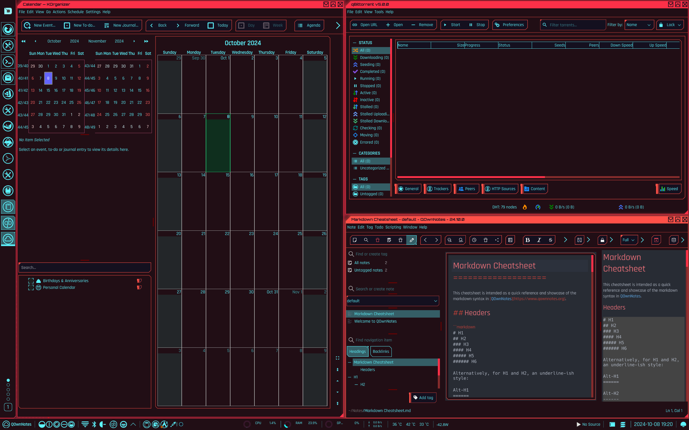
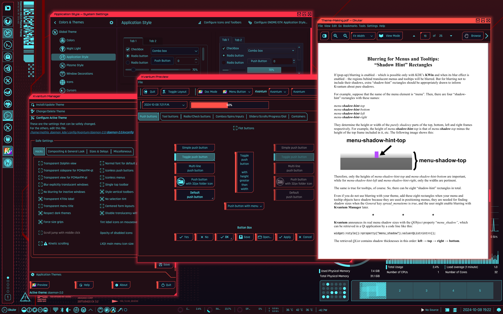
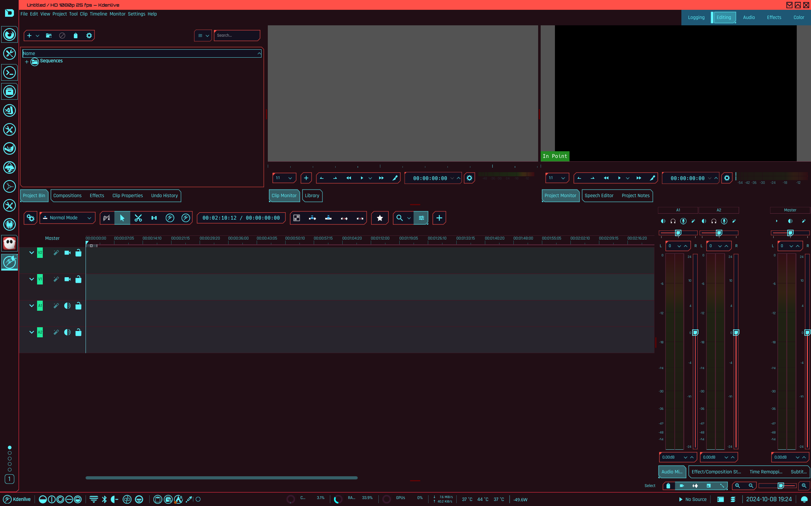

# daemon-kde-mk2
Version 2.0 of the Daemon global theme for KDE Plasma 6.
Inspired by Cyberpunk 2077, to make you feel like in a dystopian future while doing everyday tasks.

Version 1.0: https://github.com/MathisP75/daemon-dotfiles


  
  

## Installation instructions
Here's how to install this theme manually:
```
git clone https://github.com/MathisP75/daemon-kde-mk2.git
cd daemon-kde-mk2
cp 'Color Scheme/Daemon2.colors' $HOME/.local/share/color-schemes/
cp -r Kvantum/daemon-2.0 $HOME/.config/Kvantum/
cp -r 'Icon Theme/Daemon-Icons' $HOME/.local/share/icons/
cp -r 'Plasma Style/Daemon-2.0' $HOME/.local/share/plasma/desktoptheme/
cp -r 'Window Decorations/daemon-2.0' $HOME/.local/share/aurorae/themes/
cp Konsole/Daemon-2.0.colorscheme $HOME/.local/share/konsole/
cp -r VSCode/daemon-2.0 $HOME/.vscode-oss/extensions/
```

### Pling store
I have also uploaded the themes to the Pling store, so you can install them through the system settings.
* [Window decorations](https://www.pling.com/p/2213955/)
* [Color theme](https://www.pling.com/p/2213953/)
* [Plasma style](https://www.pling.com/p/2213923/)
* [Kvantum theme](https://www.pling.com/p/2211151/)
* [Icon theme](https://www.pling.com/p/2213960/)
* [Konsole color scheme](https://www.pling.com/p/2214176/)

### Widgets
These are the widgets I use in my setup

* [Window Title Fork](https://github.com/psifidotos/applet-window-title)
* [Apdatifier](https://github.com/exequtic/apdatifier)
* [Simple Separator](https://store.kde.org/p/2137418)
* [Netspeed Widget](https://github.com/dfaust/plasma-applet-netspeed-widget)
* [Thermal Monitor](https://invent.kde.org/olib/thermalmonitor)
* [Power Usage](https://github.com/magillos/Plasma-6-power-usage-widget)
* [MediaBar](https://github.com/panagiotopoulos/MediaBar)
* [Overview](https://himdek.com/Overview-Widget-for-Plasma/)
* [Compact Pager](https://github.com/tilorenz/compact_pager)

## Recommended configuration
* Fonts (get [here](https://fonts.google.com/specimen/Rajdhani) and [here](https://fonts.google.com/specimen/Orbitron)): 
	- General: Rajdhani Medium 10pt
	- Fixed width: Hack 10pt
	- Small: Rajdhani Medium 8pt
	- Toolbar: Rajdhani Medium 10pt
	- Menu: Rajdhani Medium 10pt
	- Window title: Orbitron 8pt
* Window Management:
	- Task Switcher: Flip Switch
	- Desktop Effects: 
		+ Virtual Desktop Switching Animation: Slide
		+ Window Management: Cube
		+ Window Open/Close Animation: [TV Glitch [Burn-My-Windows]](https://store.kde.org/p/2133819)
* Colors: Daemon-2.0
* Application Style: Kvantum
* Kvantum Theme: Daemon-2.0
* Plasma Style: Daemon-2.0
* Window Decorations: Daemon-2.0
* Icons: Daemon-2.0
* Cursors: Bibata-Original-Classic

The "D" icon for the application launcher can be found under the Assets directory.

## Wallpaper
The wallpaper has been made to fit my 2560 x 1600 laptop screen at 125% scaling. In order for it to look good, you might have to adjust it to fit your screen. You can find the SVG file in the wallpaper directory.

## Color palette
Can be found in CSS format under the Color Scheme directory.
| Name    | HEX | Swatch |
| -------- | ------- | :-----: | 
| black0 | #272932 |  |
| red0 | #710100 |  |
| red1 | #FB3048 |  |
| red2 | #FF5048 |  |
| yellow0 | #FDF500 |  |
| yellow1 | #CFED58 |  |
| green0 | #28C775 |  |
| cyan0 | #1AC5B0 |  |
| blue0 | #5DF4FE |  |
| purple0 | #9370DB |  |
| pink0 | #E455AE |  |
| magenta0 | #CB1DCD |  |
| bg0 | #331319 |  |
| bg1 | #210E15 |  |
| bg2 | #040A10 |  |
| surface0 | #14101F |  |

## Roadmap
- [X] Kvantum theme
- [X] Color theme
- [X] Window decorations
- [X] Konsole color theme
- [ ] Kate theme
- [ ] Yakuake theme
- [X] Plasma style
- [X] Icon theme
- [X] Wallpapers
- [ ] GTK theme
- [ ] Splash screen
- [ ] Sound theme
- [ ] Firefox theme
- [ ] VSCode theme (WIP)
- [ ] Global theme (WIP)

## Credits:
I made most of this theme from scratch, but some elements have been taken or adapted from other authors:
* Icon pack: Adapted from the [Simply Circles icon pack](https://github.com/ju1464/Simply_Circles_Icons), by ju1464
* Logo font by Irwanto Irwanto on [Vecteezy](https://www.vecteezy.com/vector-art/4578926-futuristic-cyberpunk-typography-design-sci-fi-glitch-cyberpunk-design)
