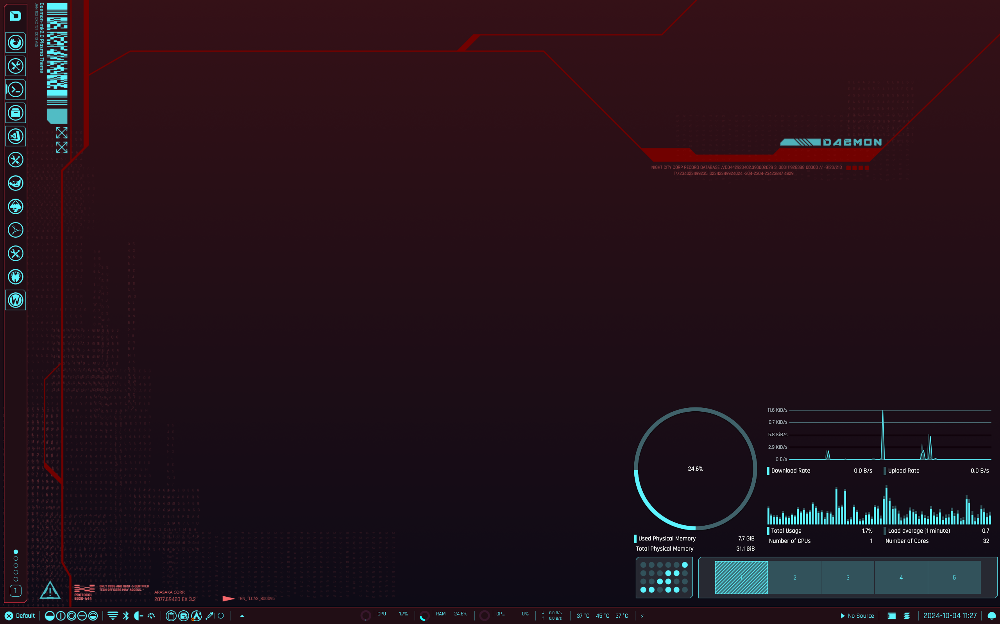
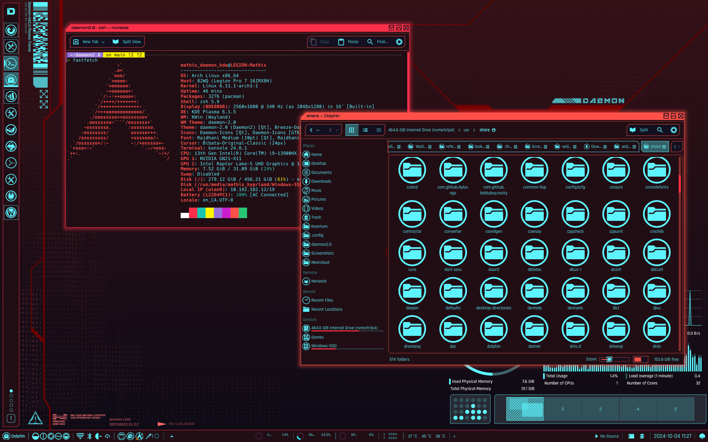

# daemon-kde-mk2
Version 2.0 of the Daemon global theme for KDE Plasma 6.
Inspired by Cyberpunk 2077, to make you feel like in a dystopian future while doing everyday tasks.

Version 1.0: https://github.com/MathisP75/daemon-dotfiles

## Roadmap
- [X] Kvantum theme
- [X] Color theme
- [X] Window decorations
- [X] Konsole color theme
- [ ] Kate theme
- [ ] Yakuake theme
- [X] Plasma style (WIP)
- [ ] Icon theme (WIP)
- [X] Wallpapers
- [ ] GTK theme
- [ ] Splash screen
- [ ] Sound theme
- [ ] Firefox theme
- [ ] Global theme

## Recommended configuration
* Fonts: 
	- General: Rajdhani Medium 10pt
	- Fixed width: Hack 10pt
	- Small: Rajdhani Medium 8pt
	- Toolbar: Rajdhani Medium 10pt
	- Menu: Rajdhani Medium 10pt
	- Window title: Orbitron 8pt
* Window Management:
	- Task Switcher: Flip Switch
	- Desktop Effects: 
		+ Virtual Desktop Switching Animation: Slide
		+ Window Management: Cube
		+ Window Open/Close Animation: TV Glitch [Burn-My-Windows]
* Colors: Daemon-2.0
* Application Style: Kvantum
* Kvantum Theme: Daemon-2.0
* Plasma Style: Daemon-2.0
* Window Decorations: Daemon-2.0
* Icons: Daemon-2.0
* Cursors: Bibata-Original-Classic